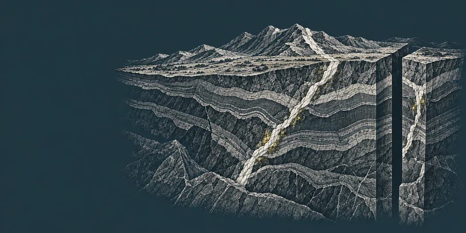

# Responsive geology illustrations

Web delivery encodings of the three existing standalone ImageGen illustrations. The PNG originals in `../../mockups/01/elements/` were read only; these outputs preserve their full frame, aspect ratio, colors, and contents. No creative edits, crops, or recoloring were applied. The originals remain the design masters.

## Variants and budget

Each asset has 640, 960, and 1440 pixel wide WebP variants at quality 88. Source dimensions cap the largest rendition; no image is upscaled. At q88, the 1440 variants range from 198 KiB (`archive-to-field`) to 257 KiB (`portfolio-specimens`), within the proposed 350 KiB mobile-large-image budget. The small 640 variants range from 38–51 KiB. These are measured output sizes, not estimates. Full dimensions, exact bytes, and SHA-256 hashes for sources and outputs are in `manifest.json`.

## Suggested use

Use `<picture>`/`srcset` so the browser selects a suitable width. The source illustration can be decorative (`alt=""`) when adjacent text fully explains its role; otherwise use the localized draft alternative below. Give images intrinsic width and height from the manifest to reserve layout space. Load below-the-fold images lazily.

```html

```

Set `width` and `height` to the chosen asset’s intrinsic ratio: `geology-cutaway` is 2:1; the other two are 3:2. For meaningful images, match `alt` to the specific information conveyed by its placement. Do not describe these as actual sites, assay samples, archival records, or company evidence.

## Draft alternatives

| Asset                 | Role                                                                                     | EN                                                                     | RU                                                            | 中文（简体）                           |
| --------------------- | ---------------------------------------------------------------------------------------- | ---------------------------------------------------------------------- | ------------------------------------------------------------- | -------------------------------------- |
| `geology-cutaway`     | Meaningful hero illustration; may be decorative beside equivalent explanatory text       | “Illustration of layered rock strata and a geological cutaway.”        | «Иллюстрация слоистых пород и геологического разреза.»        | “地层与地质剖面的示意插图。”           |
| `portfolio-specimens` | Meaningful portfolio visual marker; generated specimens do not prove metal content       | “Illustrative rock specimens representing gold and copper directions.” | «Условные образцы пород для золотого и медного направлений.»  | “代表黄金与铜方向的示意岩石样品。”     |
| `archive-to-field`    | Meaningful method illustration; can be decorative where adjacent method copy is complete | “Illustration of geological reports, field notes, and rock cores.”     | «Иллюстрация геологических отчётов, полевых записей и керна.» | “地质报告、野外记录与岩芯的示意插图。” |

Chinese alternatives are drafts and need editorial review. Use empty alt when the same information is already stated in nearby text; do not repeat captions verbatim in alt.

## Visual check

`comparison.html` places each untouched PNG next to the 640 and 960 WebP variants. The local source/variant comparison retained the fine line work and showed no washed-out engraving. `manifest.json` is the byte/dimension/hash record. All nine output files were decoded and checked against their dimensions and hashes. Source hashes remained unchanged.
